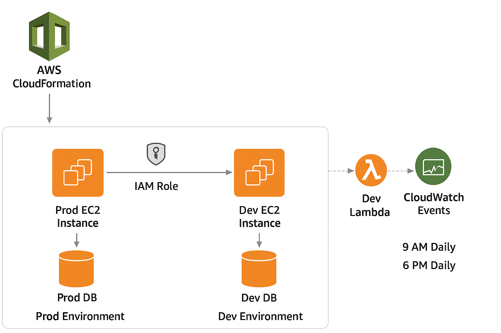

# WordPress Deployment on AWS

## Project Overview

This project demonstrates a **WordPress deployment on AWS** with both **Production** and **Development/Test environments**. The architecture leverages AWS services for automation, scalability, and monitoring.

**Key Features:**

- Automated deployment using **AWS CloudFormation**  
- **Production EC2 instances** hosting WordPress (always running)  
- **Development EC2 instances** hosting WordPress (start/stop automated via Lambda)  
- **RDS (MySQL)** for storing WordPress content  
- **Lambda functions** to automate Dev instance start/stop  
- **CloudWatch** for scheduling Lambda executions  
- **IAM Roles & Policies** for secure access  

---

## Directory Structure

```
├── cloudformation/         # CloudFormation templates for Prod & Dev
├── docs/                   # Documentation (AWS Console setup, automation scripts, etc.)
├── images/                 # Architecture diagrams and visual assets for documentation
├── lambda/                 # Lambda function code for start/stop Dev EC2
├── scripts/                # Automation scripts (CLI-based deployment)
├── LICENSE                 # Project license
└── README.md               # This README file
```

---

## AWS Services Overview

| Service | Purpose |
|---------|---------|
| **AWS Console** | Manual management of resources and monitoring |
| **AWS CloudFormation** | Automates deployment of EC2, RDS, IAM roles, Lambda, and CloudWatch rules |
| **EC2 Instances (WordPress)** | Production and Development/Test WordPress servers |
| **RDS (MySQL)** | Databases for WordPress content (Prod & Dev) |
| **Lambda** | Automates start/stop of Development EC2 instances |
| **CloudWatch** | Schedules Lambda executions via cron rules |
| **IAM Roles & Policies** | Provides secure permissions for Lambda to manage EC2 |

---

## Architecture Overview



### Diagram (Text Representation)

```
       +----------------+
       | AWS Console    |
       +-------+--------+
               |
               v
       +---------------------+
       | CloudFormation      |
       | (Deploy EC2, RDS,  |
       |  IAM Roles & Policies)
       +---------------------+
               |
      -----------------------------
      |                           |
      v                           v
+-------------+             +-------------+
| EC2 Prod    | ----------> | RDS Prod    |
| WordPress   |             | MySQL DB    |
+-------------+             +-------------+
      
+-------------+             +-------------+
| EC2 Dev     | ----------> | RDS Dev     |
| WordPress   |             | MySQL DB    |
+-------------+             +-------------+
      ^
      |  IAM Role (Lambda controls ONLY Dev EC2)
      |
+----------------+
| Lambda         |
| Start/Stop Dev |
+----------------+
      ^
      |
      v
+----------------+
| CloudWatch     |
| (Schedules Lambda for Dev EC2)
+----------------+
```

**Notes:**

- **Production EC2 instance:** Always running to serve live traffic.  
- **Development/Test EC2 instance:** Start/stop controlled by Lambda for cost optimization.  
- **CloudFormation:** Automates the creation of EC2, RDS, IAM, Lambda, and CloudWatch.  

---

## Deployment Options

### 1. CloudFormation Stack (Recommended)
- Launch both **Production** and **Development/Test** stacks via CloudFormation.  
- Automatically provisions EC2, RDS, WordPress, IAM roles, Lambda functions, and CloudWatch rules.  
- Follow the detailed **Setup / Deployment Instructions** below.

### 2. Manual via AWS Console
- Manually create EC2, RDS, and WordPress instances via the AWS Management Console.  
- Configure IAM roles, Lambda functions, and CloudWatch rules manually.  
- Detailed instructions: [docs/aws_console_setup.md](docs/aws_console_setup.md)

### 3. Automated via Scripts
- Deploy using pre-built automation scripts (CLI-based).  
- Scripts handle provisioning of EC2, RDS, WordPress, IAM roles, Lambda, and CloudWatch events.  
- Detailed instructions: [docs/automated_setup.md](docs/automated_setup.md)  

---

## Usage

### Access WordPress

- **Production:** `http://<prod-ec2-public-dns>`  
- **Development/Test:** `http://<dev-ec2-public-dns>` (start via Lambda if stopped)  

### Automated Dev EC2 Start/Stop

- Lambda executes on CloudWatch schedule:  
  - Example: Start Dev at `8:00 AM`, Stop Dev at `8:00 PM`  

---

## IAM Permissions for Lambda

Lambda requires the following IAM policy:

```json
{
    "Version": "2012-10-17",
    "Statement": [
        {
            "Effect": "Allow",
            "Action": [
                "ec2:StartInstances",
                "ec2:StopInstances",
                "ec2:DescribeInstances"
            ],
            "Resource": "*"
        }
    ]
}
```

---

## Notes

- Production environment is always available for live traffic.  
- Development/Test environment can be cost-optimized by using automated start/stop.  
- CloudFormation ensures consistent, repeatable infrastructure provisioning.

